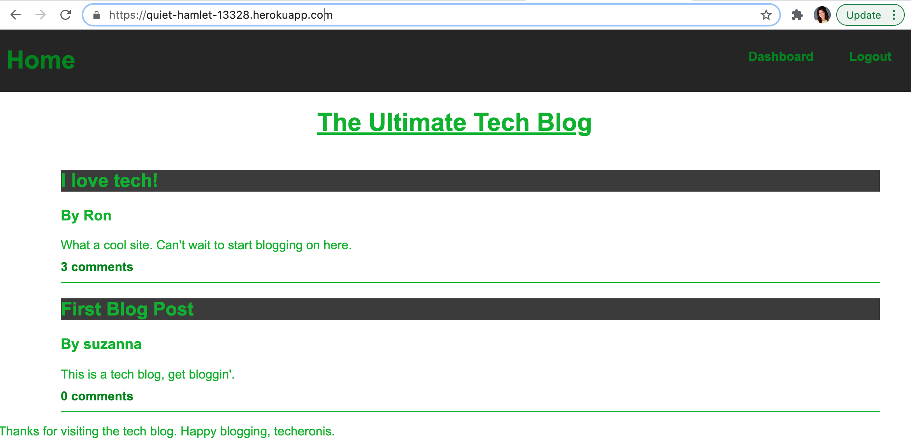

# Tech Blog

## Description
This is my first full stack application, where I developed the backend using sequelize to create databases, and routes. Then I used handlebars to make the front end HTML templates.  

It was challenging to keep track of so many folders and files, but all came together in the end!  I am still having issues with trying to reset the login and signup forms, but nothing seems to fix it.

Here is a preview of the website: 

## Table of Contents
* [Installation](#installation)
* [Usage](#usage)
* [Contributing](#contributing)
* [Tests](#tests)
* [Questions](#questions)

## Installation
To install necessary dependencies, run the following command:
npm install express sequelize mysql2 dotenv

## Usage
You will need to populate the connection with YOUR DB_NAME and DB_PASSWORD for mysql2.
Use the finished app at [Tech Blog Website](https://quiet-hamlet-13328.herokuapp.com/).

## Contributing
Be my guest!

## Tests
To run tests, run the following command: 
npm test

## Questions
If you have any questions about the repo, open an issue or contact me directly on LinkedIn.
You can find more of my work at github.com/suzannaakins.
